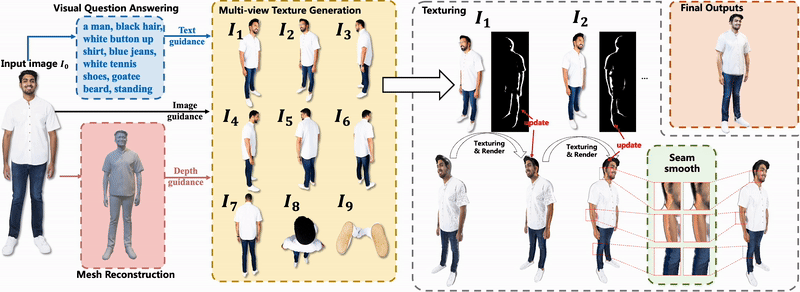

# Ultraman: Single Image 3D Human Reconstruction with Ultra Speed and Detail

[You can see some interesting examples on the project homepage.](https://air-discover.github.io/Ultraman/)


## [🗂Project Page](https://air-discover.github.io/Ultraman/) | [](https://arxiv.org/abs/2403.12028)

<a href="https://github.com/tomorrow1238" target="_blank">Mingjin Chen, </a>
<a href="https://scholar.google.com/citations?hl=en&user=uVMnzPMAAAAJ" target="_blank">Junhao Chen, </a>
<a href="https://scholar.google.com/citations?user=BKMYsm4AAAAJ&hl=en" target="_blank">Xiaojun Ye, </a>
<a href="https://scholar.google.com/citations?hl=en&user=WvbKfLgAAAAJ" target="_blank">Huan-ang Gao, </a>
<a href="https://scholar.google.com/citations?hl=en&user=_tz64W0AAAAJ" target="_blank">Xiaoxue Chen, </a>
<a href="https://scholar.google.com/citations?user=JHvyYDQAAAAJ" target="_blank">Zhaoxin Fan, </a>
<a href="https://scholar.google.com/citations?hl=en&user=ygQznUQAAAAJ" target="_blank">Hao Zhao </a>

---
## ✨Introduction
Without any 3D or 2D pre-training, our proposed Ultraman is able to quickly synthesize complete, realistic and highly detailed 3D avatars based on a single input RGB image.



## 🛠Setup
The code is tested on Ubuntu 20.04 LTS with PyTorch 1.12.1 CUDA 11.3 installed. Please follow the following steps to install PyTorch first. To run our method, you should at least have a NVIDIA GPU with 32 GB RAM.

```
# create and activate the conda environment
conda create -n ultraman python=3.9.15
conda activate ultraman

# install PyTorch 1.12.1
conda install pytorch==1.12.1 torchvision==0.13.1 torchaudio==0.12.1 cudatoolkit=11.3 -c pytorch
```

Then, install PyTorch3D:
```
# install runtime dependencies for PyTorch3D
conda install -c fvcore -c iopath -c conda-forge fvcore iopath
conda install -c bottler nvidiacub

# install PyTorch3D
conda install pytorch3d -c pytorch3d
```

Install 'xformers' to accelerate transformers:
```
# please don't use pip to install it, as it only supports PyTorch>=2.0
conda install xformers -c xformers
```

Install the necessary packages listed out in requirements.txt:
```
pip install requirements.txt
```

To download IP-Adapter Depth2Image model with the following code or you can follow by [IP-Adapter](https://github.com/tencent-ailab/IP-Adapter) and put the model into the models/IP-Adapter:
```
cd models/IP-Adapter
git lfs install
git clone https://huggingface.co/h94/IP-Adapter
mv IP-Adapter/models models
mv IP-Adapter/sdxl_models sdxl_models
```

To download [2K2K](https://github.com/SangHunHan92/2K2K) pretrained model with the following code:
```
cd models/2K2K/checkpoints && wget https://github.com/SangHunHan92/2K2K/releases/download/Checkpoint/ckpt_bg_mask.pth.tar
```

We use [openpose](https://github.com/CMU-Perceptual-Computing-Lab/openpose) to extract 2d keypoints and we use Windows Portable Demo to get `json` file. You can intall it follow [this](https://github.com/CMU-Perceptual-Computing-Lab/openpose/blob/master/doc/01_demo.md).

Then you need to get you REPLICATE API token [(get your token here)](https://replicate.com/signin?next=/account/api-tokens) and Clipdrop cleanup API token [(get your token here)](https://clipdrop.co/apis) and put Clipdrop cleanup API token in `./lib/projection_helper.py` line 586 `YOUR_API_KEY`.

## 🛠Run
You can get `json` keypoint file with following code:
```
bin\OpenPoseDemo.exe --image_dir {img_folder} --write_json {img_folder} --hand --write_images {img_folder}\test --write_images_format jpg
```

Then, we provide 2 running scripts at `./bash/run_mesh.sh` and `./bash/make_caption.sh`

You can use the following code for Mesh Reconstruction:
```
./bash/run_mesh.sh {json_file_folder} {img_name} {mesh_result_save_folder}
```

After Mesh Reconstruction, you can make the caption for the image and get the `.sh` file to generate texture.
```
./bash/caption_get_sh.sh {mesh_result_save_folder} {img_name} {exp_result_path} {sh_file_name}
```

Then, you can generate texture with following code:
```
./bash/{sh_file_name}
```

## 🗓ToDO List
<!-- ✅ -->
✅ 1. Release offline version of Ultraman based on 2K2K

🔘 2. Release offline version of Ultraman based on ECON

🔘 3. Further improvement of efficiency and robustness.

🔘 4. Find a better seam smoothing method.

🔘 5. Release of evaluation protocols code for comparison.


## 📜Cite
```
@article{chen2024ultraman,
  title={Ultraman: Single Image 3D Human Reconstruction with Ultra Speed and Detail}, 
  author={Mingjin Chen and Junhao Chen and Xiaojun Ye and Huan-ang Gao and Xiaoxue Chen and Zhaoxin Fan and Hao Zhao},
  year={2024},
  eprint={2403.12028},
  archivePrefix={arXiv},
  primaryClass={cs.CV}
}
```

## 🧰Acknowledgement
We have intensively borrow codes from the following repositories. Many thanks to the authors for sharing their codes.

[Text2tex](https://github.com/daveredrum/Text2Tex),
[TeCH](https://github.com/huangyangyi/TeCH),
[2K2K](https://github.com/SangHunHan92/2K2K),
[IP_Adapter](https://github.com/tencent-ailab/IP-Adapter),
[SD-XL](https://huggingface.co/docs/diffusers/en/using-diffusers/sdxl),
[ControlNet](https://github.com/lllyasviel/ControlNet)


